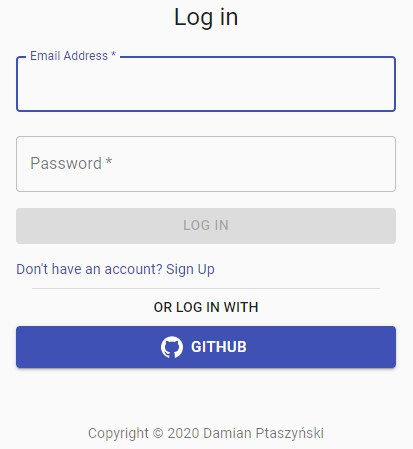

### Definicja

OAuth 2.0 - na wikipedi możemy znaleźć defnicję zaczynającą się od "standardowy protokół autoryzacji dostępu", który jednak w sobie ma już pewną nieścisłość. Dokument [RFC 6749](https://tools.ietf.org/html/rfc6749) zawierający specyfikację mówi tu o frameworku autoryzacyjnym, czyli rozwiązaniu bardziej "swobodnym i luźnym", które pozwala na różne implementacje - w przeciwieństwie do protokołu. Ale pozostawmy zabawę słowną i przejdźmy do wytłumaczenia działania.

OAuth 2.0 nakreśla w jaki sposób właściciel zasobu może dać innemu podmiotowi pewien zakres dostępu do zasobu. W praktyce wygląda to tak, że użytkownik podczas logowania do dowolnej aplikacji internetowej, niechcąc tworzyć kolejnego loginu i hasła, używa swojego profilu Google lub Facebook - czyli daje aplikacji dostęp do zasobu profilu. Oczywiście dostęp jest na określony czas i zakres (najczęściej to odczyt e-maila i podstawowych danych profilowych, np. imienia).

### Praktyka od strony użytkownika

Aby pokazać to od strony użytkownika posłużę się moją (jeszcze niewydaną) aplikacją "zbieram" na której można zalogować się przez GitHuba.

Jesteśmy użytkownikiem (czyli właścicielem zasobu) i chcemy udostępnić aplikacji "zbieram" (to jest Klient) pewien zakres danych (zasobów) z GitHuba (serwer zasobu i serwer autoryzacyjny)

Wybierając logowanie za pomocą GitHuba zostajemy przekierowani na stronę
